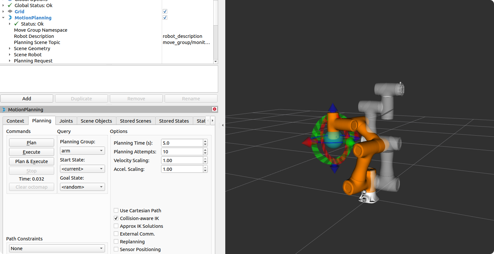

<div align="center">

 

 <h1>TCP-IP-ROS-6AXis</h1>

 **越疆机器人 ROS 软件开发套件**  
 基于 TCP/IP 协议的高性能机器人控制框架

 [English](README.md) · [简体中文](README_ZH.md)

 [](https://ubuntu.com/download/server)
 [](https://docs.ros.org/)
 [](LICENSE)

</div>

---

## 快速开始

### 环境要求

| 要求 | 版本 |
|------|------|
| 操作系统 | Ubuntu 16.04 / 18.04 / 20.04 LTS |
| ROS 版本 | ROS1 Kinetic / Melodic / Noetic |
| Python | 2.7+ / 3.8+ |

### 网络配置

| 配置项 | 说明 |
|--------|------|
| 机器人 IP (LAN1) | 192.168.5.1（需与本机同一网段） |
| 机器人 IP (LAN2) | 192.168.100.1 |
| 机器人 IP (无线) | 192.168.1.6 |
| 控制端口 (V3/V4) | 29999 |
| 运动端口 (V3) | 30003 |
| 反馈端口 (V3/V4) | 30004 |

### 安装步骤

```bash
# 创建工作空间
mkdir -p ~/catkin_ws/src
cd ~/catkin_ws/src
git clone https://github.com/Dobot-Arm/TCP-IP-ROS-6AXis.git
cd ~/catkin_ws

# 安装依赖
sudo apt update && sudo apt install -y \
  ros-${ROS_DISTRO}-moveit \
  ros-${ROS_DISTRO}-gazebo-* \
  ros-${ROS_DISTRO}-joint-state-publisher \
  ros-${ROS_DISTRO}-robot-state-publisher

# 编译
catkin_make
source devel/setup.bash

# 配置机械臂型号（根据实际型号选择）
echo "export DOBOT_TYPE=cr5" >> ~/.bashrc
# 支持型号：CR3、CR5、CR7、CR10、CR12、CR16

# 生效配置
source ~/.bashrc
```

---

## 使用方式

### 1. RViz 可视化（独立模式）

不连接真实机器人的情况下查看模型：

```bash
roslaunch dobot_description display.launch
```

### 2. RViz 连接真实机器人（V3 版本）

将真实机器人的关节状态实时显示在 RViz 中：

```bash
# 终端1：连接机器人（V3 版本）
roslaunch dobot_bringup bringup.launch robot_ip:=192.168.5.1

# 终端2：启动 RViz
roslaunch dobot_description display_connected.launch
```

### 3. RViz 连接真实机器人（V4 版本）

```bash
# 终端1：连接机器人（V4 版本）
roslaunch dobot_v4_bringup bringup_v4.launch robot_ip:=192.168.5.1

# 终端2：启动 RViz
roslaunch dobot_description display_connected.launch
```

### 4. MoveIt 虚拟演示

在 RViz 中测试运动规划（无需连接机器人，独立模式）：

```bash
roslaunch dobot_moveit demo.launch
```

> **注意**：`demo.launch` 会发布 fake 关节状态，**不要**与真实机器人驱动同时运行。

### 5. MoveIt 控制真实机器人（V3）

完整的运动规划与执行（需连接机器人）：

```bash
# 终端1：连接机器人
roslaunch dobot_bringup bringup.launch robot_ip:=192.168.5.1

# 终端2：MoveIt 控制界面
roslaunch dobot_moveit moveit.launch
```

### 6. MoveIt 控制真实机器人（V4）

```bash
# 终端1：连接机器人
roslaunch dobot_v4_bringup bringup_v4.launch robot_ip:=192.168.5.1

# 终端2：MoveIt 控制界面
roslaunch dobot_moveit moveit.launch
```

### 7. Gazebo + MoveIt 联合仿真

物理仿真与运动规划联动：

```bash
# 终端1：启动 Gazebo
roslaunch dobot_gazebo gazebo.launch

# 终端2：启动 MoveIt 控制界面
roslaunch dobot_moveit moveit.launch fake_execution:=true
```

### 8. 运动演示脚本（仅 V3 版本）

运行预构建的运动演示程序进行快速测试（**仅支持 V3 版本**）：

```bash
# 终端1：连接机器人（V3 版本）
roslaunch dobot_bringup bringup.launch robot_ip:=192.168.5.1

# 终端2：运行基础运动演示
rosrun dobot_bringup demo
```

---

## 启动参数

### 环境变量配置

| 环境变量 | 默认值 | 说明 |
|----------|--------|------|
| `DOBOT_TYPE` | cr5 | 机器人型号（cr3、cr5、cr7、cr10、cr12、cr16、me6、nova2、nova5） |

---

## 项目结构

```
TCP-IP-ROS-6AXis/
├── dobot_bringup/           # V3 版本驱动节点（TCP/IP 通信）
│   ├── include/dobot_bringup/
│   ├── src/
│   ├── launch/
│   ├── msg/
│   └── srv/
├── dobot_v4_bringup/        # V4 版本驱动节点（TCP/IP 通信）
│   ├── include/dobot_v4_bringup/
│   ├── src/
│   └── launch/
├── dobot_description/       # 机器人 URDF 模型描述
│   ├── launch/
│   │   ├── display.launch           # 独立模式
│   │   └── display_connected.launch # 连接真实机器人模式
├── dobot_gazebo/            # Gazebo 仿真配置
├── dobot_moveit/            # 通用 MoveIt 启动包
├── rosdemo_v4/              # V4 版本演示包
├── rviz_dobot_control/      # RViz 控制插件
├── cr3_moveit/              # CR3 MoveIt 配置
├── cr5_moveit/              # CR5 MoveIt 配置
├── cr7_moveit/              # CR7 MoveIt 配置
├── cr10_moveit/             # CR10 MoveIt 配置
├── cr12_moveit/             # CR12 MoveIt 配置
├── cr16_moveit/             # CR16 MoveIt 配置
├── me6_moveit/              # ME6 MoveIt 配置
├── nova2_moveit/            # Nova2 MoveIt 配置
├── nova5_moveit/            # Nova5 MoveIt 配置
├── image/                   # 图片资源
├── README.md
├── README_ZH.md
└── LICENSE
```

---

## 架构与数据流

### 驱动架构

```
ROS 应用层
  └── CRRobot（动作服务器 + 服务接口）
        └── CR5Commander（TCP 通信封装）
              └── TCP 29999（控制与运动指令）
                    └── RealTimeData（关节状态）
                          └── /joint_states（ROS 话题）
                                └── MoveIt / RViz
```

### 轨迹执行流程

```
MoveIt 规划层
  └── RRTConnect 规划器生成路径点
        └── 时间参数化模块（添加时间戳和速度）
              └── FollowJointTrajectoryAction
                    └── 控制器按顺序下发（servoj 指令）
                          └── 机器人平滑执行
```

### 关键组件

| 组件 | 包 | 职责 |
|------|-----|------|
| `cr5_robot.cpp` / `cr5_v4_robot.cpp` | `dobot_bringup` / `dobot_v4_bringup` | ROS 服务与动作服务器实现 |
| `commander.h` | `dobot_bringup` / `dobot_v4_bringup` | TCP 通信封装与数据解析 |
| `tcp_socket.cpp` | `dobot_bringup` / `dobot_v4_bringup` | Socket 底层通信 |

### 核心设计

| 设计要点 | 说明 |
|----------|------|
| **规划器** | 使用 RRTConnect，生成密集路径点 |
| **插值策略** | MoveIt 负责时间参数化，控制器按点下发 |
| **servoj t 值** | 基于相邻点时间差动态计算 |
| **停止功能** | 支持 Action 取消和服务调用停止 |

---

## 支持型号

| 系列 | 型号 |
|------|------|
| CR 系列 | CR3、CR5、CR7、CR10、CR12、CR16 |
| ME 系列 | ME6 |
| Nova 系列 | Nova2、Nova5 |

---

## 启动文件参考

| 启动文件 | 包 | 说明 |
|----------|-----|------|
| `bringup.launch` | `dobot_bringup` | V3 版本机器人驱动 |
| `bringup_v4.launch` | `dobot_v4_bringup` | V4 版本机器人驱动 |
| `display.launch` | `dobot_description` | RViz 可视化 |
| `demo.launch` | `{型号}_moveit` | MoveIt 演示（虚拟模式） |
| `{型号}_moveit.launch` | `{型号}_moveit` | MoveIt 控制界面 |
| `gazebo.launch` | `dobot_gazebo` | Gazebo 物理仿真 |

---

## 协议说明

### 端口功能

#### V3 版本端口

| 端口 | 功能 | 特点 |
|------|------|------|
| 29999 | 控制端口 | 一发一收，单客户端 |
| 30003 | 运动端口 | 队列指令 |
| 30004 | 实时反馈 | 每 8ms 更新 |

#### V4 版本端口

| 端口 | 功能 | 特点 |
|------|------|------|
| 29999 | 控制与运动端口 | 统一端口，支持多指令类型 |
| 30004 | 实时反馈 | 每 8ms 更新 |

### 机器人状态码

| 状态码 | 描述 |
|--------|------|
| 1 | 初始化状态 |
| 2 | 抱闸松开 |
| 3 | 本体下电状态 |
| 4 | 未使能(抱闸未松开) |
| 5 | 使能（空闲） |
| 6 | 拖拽模式 |
| 7 | 运行状态（含脚本和TCP队列运行） |
| 8 | 单次运动状态(点动) |
| 9 | 错误状态 |
| 10 | 暂停状态 |
| 11 | 碰撞状态 |

### 状态优先级

```
1. 报错状态为第一优先级，如机器人报错且未上使能，则状态返回为报错状态
2. 下电状态为第二优先级，如机器人未上电，未上使能，则状态返回未上电状态
3. 碰撞状态为第三优先级，如机器人处于碰撞，脚本暂停，则状态返回碰撞状态
4. 开抱闸状态为第四优先级，如机器人开抱闸，未使能状态，则状态返回开抱闸状态
   其余状态根据实际情况反馈。
```

---

## 常见问题

### TCP连接问题

- **端口限制**：29999端口为单客户端连接，只允许一个客户端连接；30004端口可以多客户端同时连接
- **模式限制**：29999端口有机器人模式限制，开放前需要先将机器人设置为TCP模式，否则指令发送后无法响应并返回"Control Mode Is Not Tcp"
- **实时反馈端口**：30004端口无模式限制

### 坐标系问题

- 进入TCP/IP模式默认会将用户/工具坐标系设置为0，退出TCP/IP模式自动恢复至上位机设置的用户/工具坐标系索引值
- **全局坐标**：`User()`、`Tool()`指令设置的是全局坐标系，设置后对所有指令均生效
- **局部坐标**：运动指令中带的user/tool可选参仅在当前运动指令生效，执行完当前指令后恢复至全局坐标系

### 队列指令特性

- 算法允许的队列深度为64，可同时连续处理64条队列指令
- 队列指令为立即返回指令，接口返回成功仅代表发送成功，不代表执行完毕
- 判断执行完毕需要结合`CommandID`和`RobotMode`来综合判断

### 不同机器状态响应指令

- **错误状态(9)**：可执行指令：`ClearError()`、`GetErrorID()`、`EmergencyStop()`、`RobotMode()`，其余指令均拒绝指令，返回-2
- **下电状态(3)**：可执行指令：`ClearError()`、`GetErrorID()`、`EmergencyStop()`、`RobotMode()`、`PowerOn()`，其余指令均拒绝指令，返回-4

### 多机器人控制

如需控制多台真实机械臂，可修改 `dobot_v4_bringup/launch/bringup_v4.launch` 文件：

```xml
<node name="$(arg robotName)$(env DOBOT_TYPE)_robot" pkg="dobot_v4_bringup" type="dobot_v4_bringup" output="screen" >
  <param name="robot_node_name" type="str" value="$(arg robotName)"/>
  <param name="robot_ip_address" type="str" value="$(arg robot_ip)"/>
</node>
```

启动命令：
```bash
# 连接机械臂A
roslaunch dobot_v4_bringup bringup_v4.launch robot_ip:=192.168.100.10 robotName:=robotA

# 连接机械臂B
roslaunch dobot_v4_bringup bringup_v4.launch robot_ip:=192.168.100.20 robotName:=robotB
```

---

## 注意事项

> ⚠️ **安全第一**：运行前确保机器人在安全位置

1. 确保电脑 IP 与机器人在同一网段（192.168.X.X）
2. 确保端口 29999、30003 和 30004 未被占用
3. 机器人需处于远程 TCP/IP 控制模式
4. 29999 端口仅支持单客户端连接

---

## 版本信息

| 信息 | 内容 |
|------|------|
| 当前版本 | v1.0.0.0 |
| ROS 版本 | ROS1 Kinetic / Melodic / Noetic |
| 协议版本 | Dobot TCP/IP V3 / V4 |

---

## 许可证

[MIT License](LICENSE)

<div align="center">
Built by Dobot-Arm
</div>
